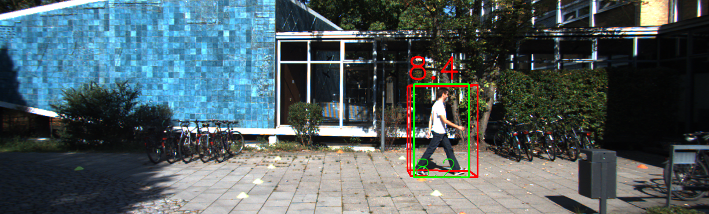
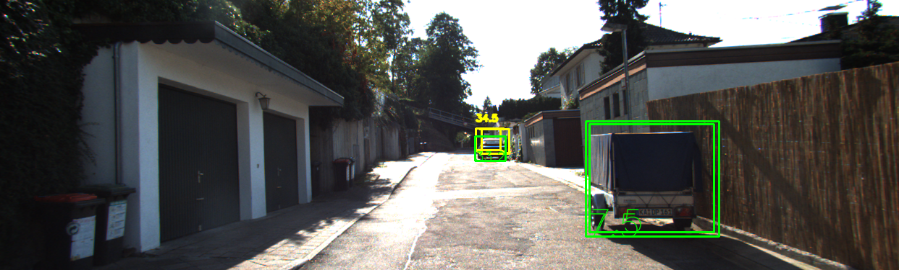

# Comparative Analysis between YOLO 3 and YOLO Complex 


This project performs comprativie analysis between YOLO 3 and YOLO Complex versions 3 and 4. Two pre-trained models on Kitti dataset are utilized to detect three categories: pedestrians, cars, and bicycles.

## Motivation
This comparative analysis is helpful in applications which require multiple sensors. For example, autonomous cars usually uses depth camera (2D) and LIDAR (3d) to percieve the surroundings. So the accuracy for the two sensors individually and combined should be high enough. Thus, this project combines between the LiDAR and camera sensors which ensures a backup to the object detection task, in case either of the two sensors is faulty.
 
## Dataset & Preprocessing
KITTI dataset is used in this project. Due to its extreme large size, we only used a smaller portion of the dataset, which is uploaded on this drive [link](https://drive.google.com/u/0/uc?id=1E_rfrPgVLx7l8OwbnuLRkbVARRKtlv3u&export=download). The data are defined as follows:

| Folder           | Content |
| -----------------|:--------|
| Velodyne         | contains 3D point cloud   |
| Image            | contains RGB images obtained from camera (used for visualization)   |
| Label            | contains the ground truth bounding boxes and labels   |
| Calibration      | contains transformations between LiDAR coordinates and camera coordinates   |

As a preprocessing, all the 3d point clouds are converted into 2d bird eye view (BEV) images since YOLO model only deals with 2d images.


## Models   
We used three  different models in this project. YOLO Complex3 and YOLO complex4 are used with point cloud while YOLO v3 are used with 2d images. The system desing is shown in the following image.


Since two different vesions used for YOLO Complex, the hyperparameters are different and are summarized in this table:
|                    | YOLO V3  | YOLO V3    
| -------------------|:-------- |:-----------
| Image size         | 608 x 608 x 3     |608 x 608 x 3      
| Convolution Layers | 106               |110        
| Batch Size         | 64                |64        
| Momentum           | 0.9               |0.949        
| Learning Rate      | 0.001             |0.0013        

More technical details can be found in project report and presentation in the [documentation folder](./Docs/).

## Results
A sample result for both models, the 2d bounding box (green color) is from YOLO 3 and the 3d bounding box (different colors) is from COmplex YOLO.




## Evaluation Metrics
This table shows the average percision (AP) for the two complex models:
| Model              | Car      | Pedestrian | Cyclist | Average |
| -------------------|:-------- |:-----------|:--------|:--------|
| Complex-YOLO-v3    | 0.98     |0.75        |0.75     |0.833    |
| Complex-YOLO-v4    | 1        |0.86        |1        |0.95     |

## Folder structure

```
${ROOT}
└── Documentation/    
    └── Presentation.pdf
    └── Project-Report.pdf
├── README.md 
├── Complexv3_Yolo3.ipynb
└── Complex_Yolo4.ipynb
```


## Disclaimer
This project was contributed equally by me and  [Sohaila Ahmed](https://github.com/sohaila-ahmed3011) as part of Computer Vision course by Porf **Adil Khan** at Innopolis Univeristy (Spring 2022) .


